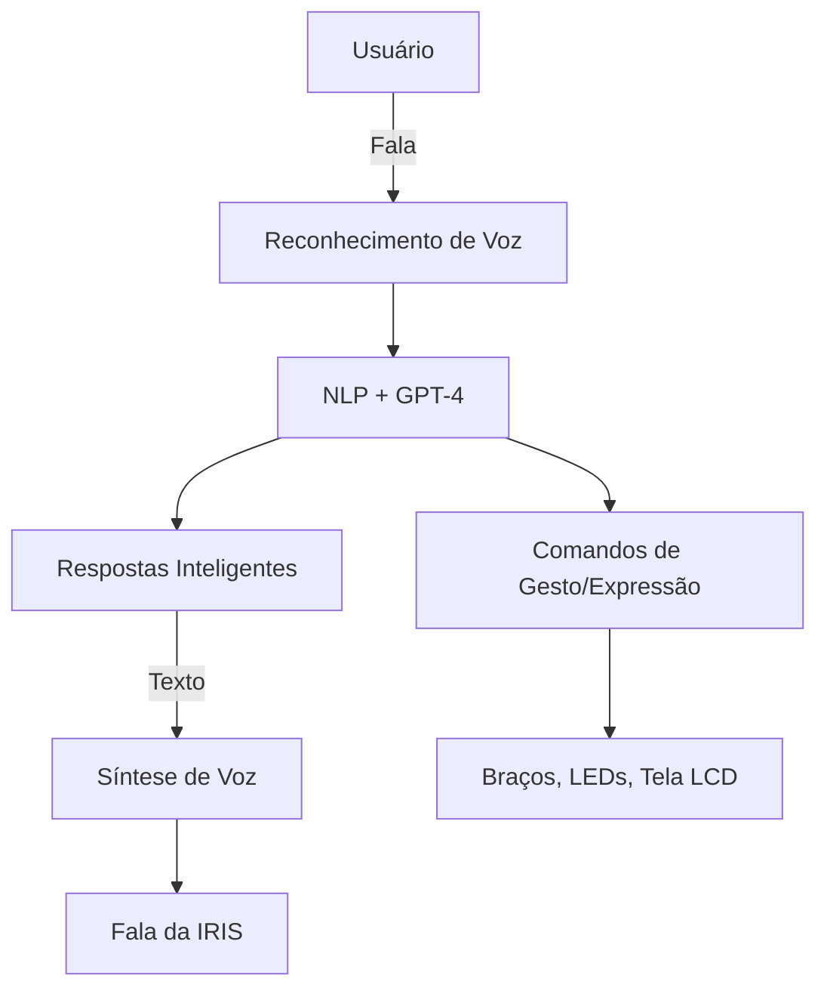

<h1 align="center">
  🤖 IRIS – Plataforma de Robótica Social com Inteligência Emocional Artificial
</h1>

  
  
  

---

## 🌐 Visão Geral

> **IRIS** é uma robô social de arquitetura modular, com foco em **interação emocional, aprendizado de máquina e inclusão tecnológica**.  
> A proposta alia acessibilidade, IA generativa e expressividade robótica para construir **interações humano-máquina significativas**.

---

## 🎯 Objetivos Estratégicos

- Criar um robô social de **baixo custo, alto impacto e fácil replicação**.
- Integrar IA generativa com sensores físicos para simular empatia e cognição.
- Viabilizar testes acadêmicos em **educação, saúde mental, terapias e acolhimento**.
- Atrair **pesquisadores, empresas e aceleradoras** para desenvolver verticais aplicadas.

---

## 🧩 Tecnologias e Arquitetura

| Pilar | Tecnologias Utilizadas |
|-------|------------------------|
| 🧠 NLP & IA | OpenAI GPT-4 / Whisper, HuggingFace Transformers |
| 👂 Reconhecimento de voz | STT com Whisper API e TTS com ElevenLabs / Coqui.ai |
| 🤖 Expressividade | LEDs, tela LCD, animações faciais e movimento corporal |
| 🎮 Controle físico | Arduino, Raspberry Pi, servos, sensores táteis |
| 👁️ Visão computacional | OpenCV, MediaPipe, detecção de emoções e rostos |
| 🌐 Integração | MQTT, RESTful APIs, Firebase (dados em tempo real) |

---

## 🧠 Diagrama Funcional

---

## 🎯 Casos de Uso

- 👨‍🏫 Robô interativo em escolas e museus
- 👵 Companhia para idosos e pessoas com autismo
- 🎤 Apresentadora digital para feiras e eventos
- 🧪 Robô experimental em laboratórios de pesquisa

---

## 📦 Roadmap

| Fase | Status | Entregas |
|------|--------|----------|
| Fase 1 | ⏳ Em planejamento | Protótipo físico com tela, voz e rodas |
| Fase 2 | ⏳ Em planejamento | Integração GPT-4 + TTS/STT |
| Fase 3 | ⏳ Em planejamento | Detecção emocional facial e vocal |
| Fase 4 | ⏳ Em planejamento  | IA adaptativa com aprendizado local |
| Fase 5 | ⏳ Em planejamento | Publicações científicas e testes de campo |

---

## 📸 Protótipo

  

---

## 👤 Sobre o Autor

**Paulo Cezar Pereira Limeira**  
Empreendedor e pesquisador em tecnologias sociais com foco em IA aplicada, robótica afetiva e experiências imersivas.

🔗 GitHub: [PauloCezarPereiraLimeira](https://github.com/PauloCezarPereiraLimeira)  
📧 Contato: *[inserir seu e-mail ou portfólio]*

---

## 🤝 Captação e Apoio

Estamos abertos a:

- Colaborações com **instituições científicas**
- Parcerias com **empresas de base tecnológica**
- Submissão a **editais de inovação, ICTs e fomento público**
- Criação de **provas de conceito em ambientes reais**

> **Quer apoiar ou investir?**  
> Entre em contato e seja parte da evolução da interação homem-máquina.

---

  

